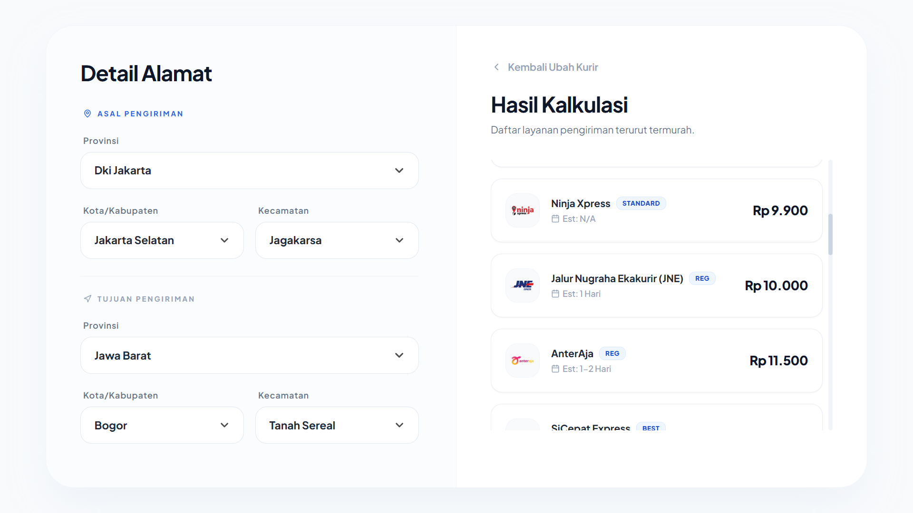

# RajaOngkir Domestic Cost Simulator



A simple web-based simulator for RajaOngkir API domestic shipping calculation. This application allows you to simulate real-time shipping cost calculation from multiple couriers across Indonesian provinces, cities, and districts with a premium clean UI.

## Prerequisites

- [Node.js](https://nodejs.org/) (v20 or higher)
- RajaOngkir Account (Komerce ID API)
- RajaOngkir API Key from [Komerce Dashboard](https://collaborator.komerce.id/settings) (Section: Shipping Cost)

## Setup Instructions

1. **Clone the repository** (or download the source code).
2. **Install dependencies**:
   ```bash
   npm install
   ```
3. **Configure Environment Variables**:
   Create a `.env` file in the root directory and add your API Key:
   ```env
   API_KEY=your_api_key_here
   PORT=3000
   ```
   *Note: Use the `.env.example` as a template.*

## Running the Application

1. **Start the server**:
   ```bash
   node server.js
   ```
   or using npm scripts:
   ```bash
   npm start
   ```
2. **Access the application**:
   Open your browser and go to `http://localhost:3000`.

## Features

- **Multi-Courier Support**: Supports checking rates for JNE, SiCepat, J&T, POS Indo, TIKI, Anteraja, Ninja, Lion, and IDE Express simultaneously.
- **Dynamic Location API**: Integrates live cascading dropdowns for Provinces -> Cities -> Districts using local secure proxy.
- **Searchable Dropdowns**: Utilizes SlimSelect engine for super fast searchable location discovery.
- **View-Switch UI**: Premium dashboard architecture with sliding views for optimal responsive experiences.

## Project Structure

- `server.js`: Express server acting as a secure proxy to prevent CORS and hide authentication keys.
- `public/index.html`: The primary application entry shell.
- `public/assets/css/`: Contains custom design system `style.css` and vendor stylesheets.
- `public/assets/js/`: Categorized architecture including static definitions (`config.js`) and application brain (`script.js`).
- `public/assets/`: Contains visual logo repository for global shipping brands.
